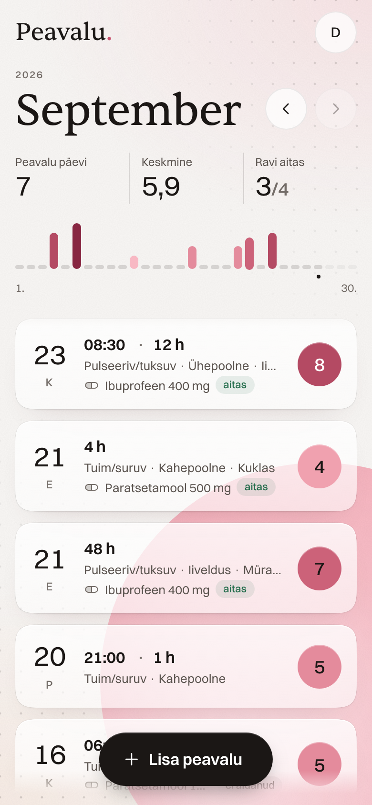
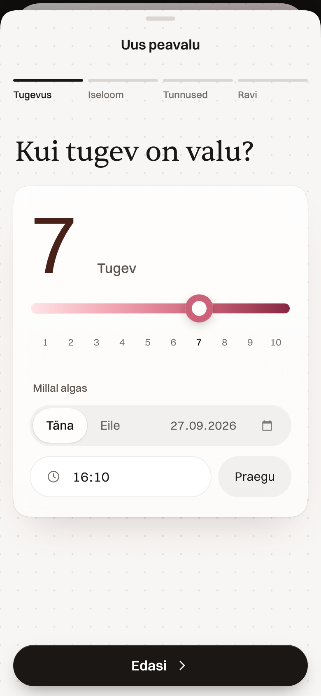
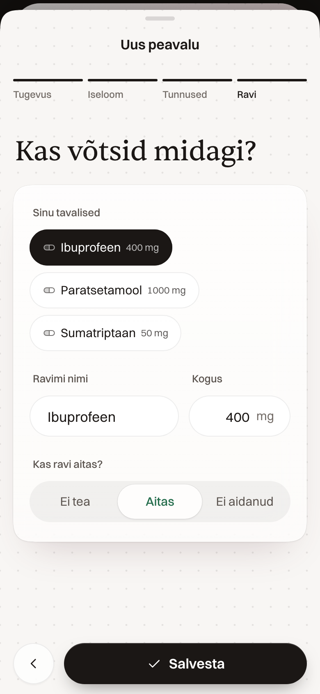
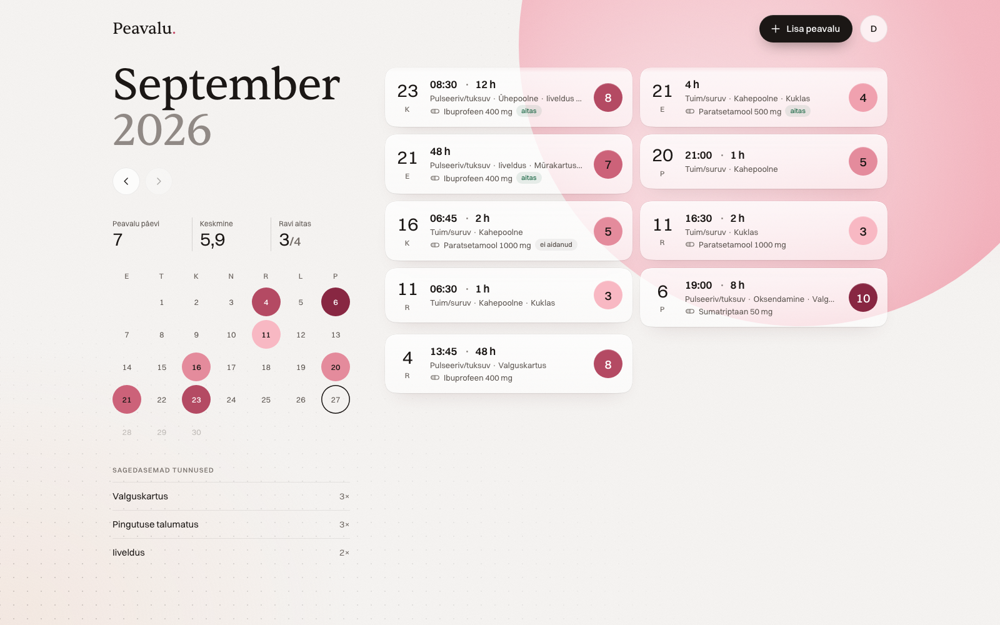
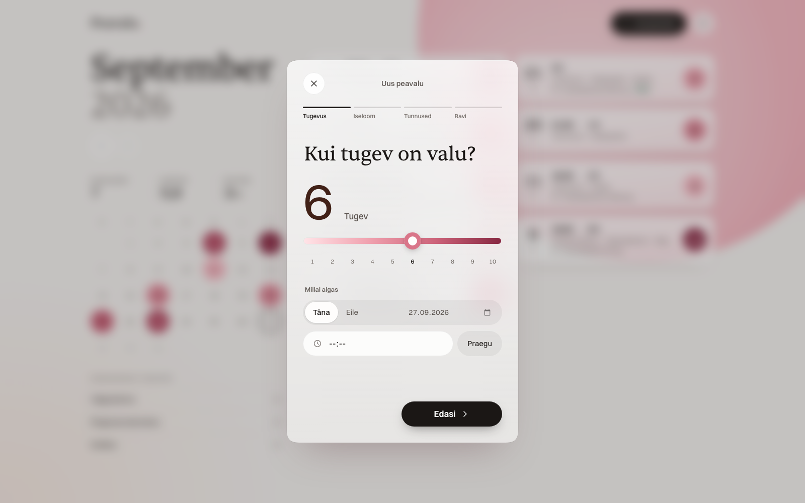
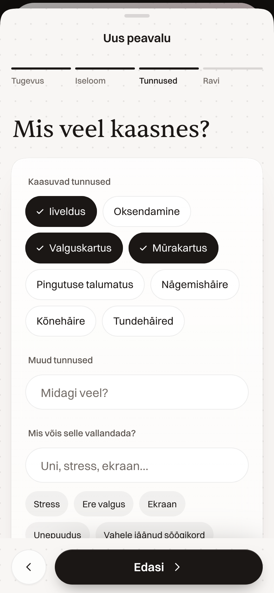
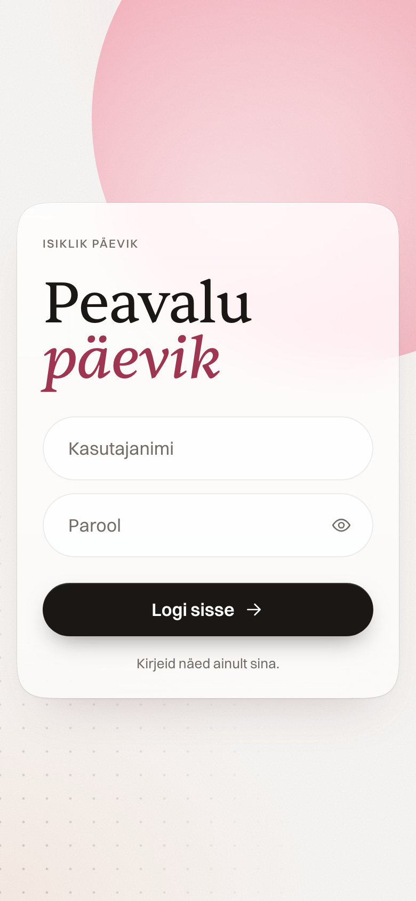

# Peavalu

A quiet, private headache diary that feels like a native iPhone app, built with nothing more than Django, one CSS file and one small JavaScript file.

*Peavalu* is Estonian for "headache". The interface is in Estonian.

<p align="center">
  
  &nbsp;
  
  &nbsp;
  
</p>

> All screenshots use generated demo data (`manage.py seed_demo`). No real entries appear anywhere in this repository.

## Why I built this

I built this for my girlfriend, who gets headaches. A diary only helps if it actually gets filled in, and the moment you need to write a headache down is exactly the moment you least want to deal with an app. Popular trackers like Migraine Buddy put around eight steps between you and "done".

So I made her one of her own. The rules were simple:

- **It has to work while it hurts.** Big tap targets, no typing required, and the most important answer (how strong is it?) comes first. Everything after that is optional.
- **It has to be hers.** One small server, a login, and no analytics or third-party accounts. Her entries are visible to her and nobody else.
- **It has to be something she wants to open.** Warm and calm rather than medical. It should feel like a well-made iPhone app, not a form.
- **It should help at the doctor's.** Months of entries, with patterns you can see at a glance and, soon, an export she can hand over.

It's a small, personal project. I'm sharing the code because the approach (a modern, app-like experience with almost no tooling) might be useful to someone building something similar for a person they care about.

## What it does

- **Log a headache in four short steps:**
  1. Intensity, with a 1–10 slider and words like *Kerge* (mild), *Tugev* (strong) and *Talumatu* (unbearable), plus when it started.
  2. What the pain is like, and how long it lasted.
  3. Accompanying symptoms and possible triggers.
  4. Medication taken, and whether it helped.
- **Learns her habits:** her most-used medications (with dose) and triggers become one-tap chips.
- **Month view:** headache days, average intensity and how often treatment helped. There's a per-day rhythm strip on the phone and a colour-coded calendar on desktop.
- **Feels like iOS:** the form opens as a sheet you pull down to dismiss, and the log behind scales back. If there are unsaved answers, it asks before discarding them. Steps can also be swiped.
- **Every screen size:** iPhone first, then a two-pane layout on desktop that stretches sensibly all the way to an ultrawide monitor.
- **Keyboard on desktop:** `N` new entry, `←`/`→` months, `J`/`K` move between entries, `1`–`0` set intensity, `Enter` next step, `⌘Enter` save, `Esc` close, `?` show all shortcuts.
- **Add to Home Screen** runs it full-screen, like an installed app.

<p align="center">
  
</p>
<p align="center">
  
</p>
<p align="center">
  
  &nbsp;
  
</p>

## The simple build

There is no frontend build step at all. No npm, no bundler, no framework.

| Layer | What's used |
| --- | --- |
| Server | Django 6.1, SQLite, server-rendered templates, gunicorn + WhiteNoise in production |
| Navigation | [htmx](https://htmx.org) 2 (`hx-boost` + preload) with native View Transitions |
| Styles | One hand-written CSS file (`static/css/app.css`) |
| Behaviour | One small vanilla JS file (`static/js/app.js`) |
| Fonts | [Sentient](https://www.fontshare.com/fonts/sentient) + [Switzer](https://www.fontshare.com/fonts/switzer) from Fontshare |

Everything is progressive enhancement: with JavaScript off, every page and form still works as plain HTML. The JavaScript adds the step flow, the sheet, the live intensity readout, one-tap fills and the keyboard shortcuts.

A few details I enjoyed getting right:

- **The page never scrolls. Only the data does.** The app shell is fixed to the viewport, with safe-area insets for the iPhone notch and home bar.
- **The stylesheet is a design system, not a pile of values:**
  - An Apple Dynamic Type ramp (17px body, nothing below 11px).
  - A 4pt spacing grid and 44pt minimum tap targets.
  - Capsule controls with concentric corners (inner radius = outer radius − padding), and Apple-style squircle corners where the browser supports them.
- **Colour is defined in OKLCH, with contrast checked.** The ten intensity colours are even lightness steps. The text on each one is dark or white based on measured WCAG contrast, not guesswork.
- **Fonts were chosen by looking, not by describing.** Four pairings were compared side by side on real screens in Estonian before picking one.
- **Motion is short and purposeful.** Springs where things land, and numbers that roll in the direction you slide. The OS "Reduce Motion" setting is respected throughout.

## Run it locally

```bash
python -m venv venv
source venv/bin/activate
pip install -r requirements.txt

python manage.py migrate
python manage.py seed_demo          # optional: demo user "demo" / "demo" with a few months of fake data
python manage.py createsuperuser    # optional: for /admin
python manage.py runserver
```

Open http://127.0.0.1:8000 and log in. `seed_demo` only runs with `DEBUG` on; see `--help` for `--months`, `--clear` and `--seed`.

Run the tests with:

```bash
python manage.py test
```

## Deploying to Railway

The repo is ready for [Railway](https://railway.com) as it is. `railway.json` sets the start command and healthcheck, and the settings pick up Railway's own variables.

1. **Create a service from the GitHub repo.** Railpack detects Python (version pinned in `.python-version`) and installs `requirements.txt`.
2. **Attach a volume** to the service, at any mount path such as `/data`. The SQLite database lives there. Without a volume the app refuses to start, because the diary would otherwise be wiped on every deploy.
3. **Set one variable:** `DJANGO_SECRET_KEY`. Generate a value with:
   ```bash
   python -c "import secrets; print(secrets.token_urlsafe(50))"
   ```
4. **Generate a domain** under the service's Networking settings, then deploy.
5. **Create the accounts** once it's running:
   ```bash
   railway ssh
   python manage.py createsuperuser
   ```
   Then add the everyday (non-admin) account from `/admin` → Users.

Each deploy runs migrations, collects static files and starts gunicorn. The migrations run in the start command rather than as a pre-deploy step, because Railway only mounts volumes when the container starts. `/healthz` is the healthcheck; it's public and checks that the database answers.

The settings also handle the rest automatically:

| | |
| --- | --- |
| Debug | Off on Railway, on locally. Override with `DJANGO_DEBUG`. |
| Hosts and CSRF | `RAILWAY_PUBLIC_DOMAIN` and Railway's healthcheck host are allowed automatically. Add custom domains with `DJANGO_ALLOWED_HOSTS` and `DJANGO_CSRF_TRUSTED_ORIGINS`. |
| Database | SQLite at `$RAILWAY_VOLUME_MOUNT_PATH/db.sqlite3`, in WAL mode. Override with `SQLITE_PATH`. |
| Static files | Served by WhiteNoise: hashed, compressed, cached for a year. |
| HTTPS | Redirect to HTTPS, HSTS, and secure cookies behind Railway's proxy. |
| Logs | Errors go to stdout, which appears in Railway's log view. |

It isn't tied to Railway: any host that can run gunicorn with a persistent disk works the same way, using `SQLITE_PATH`, `DJANGO_ALLOWED_HOSTS` and `DJANGO_CSRF_TRUSTED_ORIGINS`.

Back up the volume now and then (Railway can snapshot it); it holds everything.

## Privacy

- Every page requires login (`LoginRequiredMiddleware`), and every query is scoped to the logged-in user. The tests check that one account can't read another's entries.
- There's no sign-up page, no analytics and no tracking. Accounts are created by the owner (`createsuperuser` or the admin).
- The only third-party requests are the fonts (Fontshare) and htmx (jsDelivr). Self-host them if you want zero outside requests.
- The database is `.gitignore`d. Screenshots and seed data are generated.

## Roadmap

- PDF export of a date range, to share with a doctor
- Optional dark mode (light sensitivity is a real thing during a migraine)

## License

[MIT](LICENSE)
